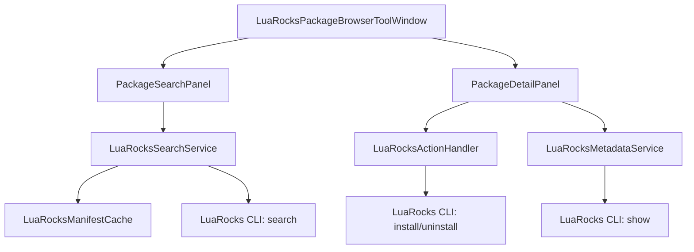

# Technical Design: Package Browser (ROCKS-02)

## 1. Overview
The Package Browser provides an IDE-native tool window for discovering and managing LuaRocks packages. It follows the "Split-view" pattern identified in the competitive investigation, mimicking the professional workflows of the npm and PyPI integrations.

## 2. Architecture

### 2.1 Component Diagram


### 2.2 Data Models
- **LuaRockPackage**: Represents a package entry.
  - `name: String`
  - `version: String`
  - `summary: String`
  - `isInstalled: Boolean`
- **LuaRockMetadata**: Detailed package information.
  - `description: String`
  - `homepage: String`
  - `license: String`
  - `dependencies: List<String>`
  - `availableVersions: List<String>`

## 3. UI Design (Visual Representation)

### 3.1 Tool Window Layout
The component will be hosted in a standard IntelliJ tool window (usually on the bottom or side).

```mermaid
graph TD
    subgraph ToolWindow [LuaRocks Packages]
        subgraph Toolbar [Search Toolbar]
            SearchInput[TextField: Search Packages...]
            FilterIcon[Icon: Filter/Repositories]
            RefreshIcon[Icon: Refresh Cache]
        end
        
        subgraph SplitView [Split Pane]
            subgraph ResultsList [Results Pane (Left)]
                Item1[inspect - 3.1.0]
                Item2[busted - 2.2.0]
                Item3[luasocket - 3.1.0]
            end
            
            subgraph DetailView [Detail Pane (Right)]
                Title[Package Name: inspect]
                VersionLine[Version: 3.1.0 v]
                InstallBtn[Button: Install / Uninstall]
                Desc[Description: Human-readable representation of Lua tables...]
                Meta[Homepage: github.com/kikito/inspect.lua]
                License[License: MIT]
            end
        end
    end
```

## 4. Key Workflows

### 4.1 Search Workflow
1. User types in `SearchInput`.
2. `PackageSearchPanel` debounces the input (300ms).
3. `LuaRocksSearchService` checks `LuaRocksManifestCache`.
4. If cache is stale or missing, it executes `luarocks search <query>`.
5. Results are parsed into `LuaRockPackage` objects and displayed in `ResultsList`.

### 4.2 Installation Workflow
1. User selects a package in `ResultsList`.
2. `DetailPanel` updates with metadata fetched via `luarocks show`.
3. User clicks `InstallBtn`.
4. `LuaRocksActionHandler` resolves the tool path via `LuaToolManager`.
5. `GeneralCommandLine` is executed for `luarocks install <package>`.
6. On success, `ResultsList` is updated to show the "Installed" state.

## 5. Implementation Details

### 5.1 Caching Strategy
- The `LuaRocksManifestCache` stores the results of `luarocks list` and common search results to ensure UI responsiveness.
- Cache is invalidated manually via `RefreshIcon` or on successful install/uninstall actions.

### 5.2 Threading
- All CLI calls must be wrapped in `ProgressManager.runProcessWithProgressAsynchronously` to prevent UI freezes.
- Results are pushed to the UI thread via `Application.invokeLater`.

## 6. Testing Strategy
- **Mocked CLI**: Unit tests for `LuaRocksSearchService` will use a mocked CLI output parser to verify data mapping.
- **UI Interaction**: Integrated tests using the IntelliJ UI testing framework to verify split-pane resizing and selection updates.
