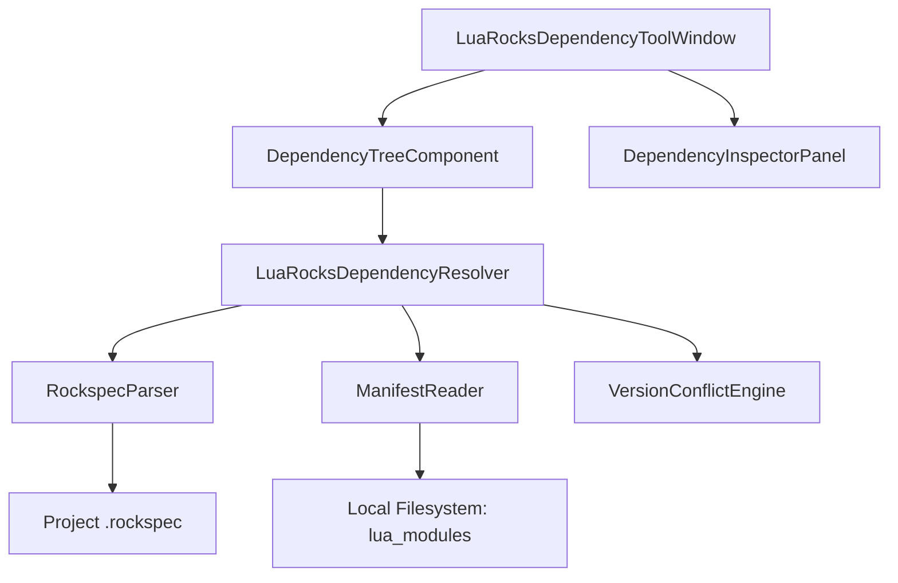
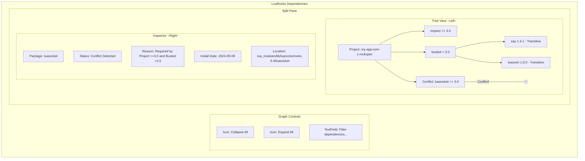

---
folders:
  - "[[features/rocks/03-dependency-resolution/requirements|requirements]]"
title: "Technical Design"
---

# Technical Design: Dependency Resolution (ROCKS-03)

## 1. Overview
The Dependency Resolution feature provides a hierarchical analysis of the project's LuaRocks dependencies. It enables developers to visualize the full dependency graph, identify transitive requirements, and proactively detect version conflicts.

## 2. Architecture

### 2.1 Component Diagram

### 2.2 Core Models
- **DependencyNode**:
  - `packageName: String`
  - `requiredVersion: VersionConstraint`
  - `resolvedVersion: String?`
  - `isTransitive: Boolean`
  - `dependencies: List<DependencyNode>`
  - `conflicts: List<ConflictInfo>`
- **VersionConstraint**:
  - `raw: String` (e.g., ">= 1.0, < 2.0")
  - `comparator: VersionComparator`
- **ConflictInfo**:
  - `type: ConflictType` (VERSION_MISMATCH, MISSING_DEPENDENCY)
  - `description: String`
  - `offendingNodes: List<DependencyNode>`

## 3. UI Design (Visual Representation)

### 3.1 Hierarchical Dependency Tree
The tree will be displayed in the "Dependencies" tab of the LuaRocks tool window.

## 4. Key Logic & Workflows

### 4.1 Dependency Resolution Algorithm
1. **Initial Seed**: Read `dependencies` table from the project's `.rockspec`.
2. **Recursive Walk**:
   - For each direct dependency, check the local `lua_modules` manifest.
   - Parse the `rockspec` of the installed dependency to find its children.
   - Continue until the leaf nodes are reached or a cycle is detected.
3. **Ghost Nodes**: If a dependency is listed in a rockspec but not found in `lua_modules`, it is rendered as a "Missing" node (Red text).

### 4.2 Version Conflict Engine
The engine performs a bi-directional check:
- **Downstream Check**: Does the resolved version of a package satisfy all constraints from its parents?
- **Global Check**: Are there multiple versions of the same package name resolved in the graph? (Though LuaRocks usually handles this via single-version trees, conflicts arise in the *requirements* phase).

### 4.3 Impact Analysis (Reverse Dependencies)
When a user selects a node, the UI can highlight its "Incoming" edges.
- **Logic**: Maintain a `Map<PackageName, Set<ParentNode>>` during the graph construction.
- **UI**: Display "Required by:" list in the InspectorPane.

## 5. Implementation Details

### 5.1 Data Source: `luarocks show` vs. Manifest Parsing
- **Manifest Parsing (Primary)**: Faster for building the whole tree. We read `lua_modules/lib/luarocks/rocks-5.x/manifest`.
- **`luarocks show` (Fallback)**: Used for deep metadata inspection of a specific package (e.g., retrieving the full description).

### 5.2 Rockspec Parsing & JSON Bridge
- The IDE will use a bundled Lua script (`src/main/lua/rockspec.lua`) to extract the `dependencies` table from rockspec files.
- **Dependency**: This script requires a Lua JSON generator (e.g., `lunajson`) to be available in the execution environment or bundled with the plugin resources to pass data back to Kotlin.

### 5.3 Conflict Tooltips
Icons in the `TreePane` will have active tooltips generated by the `VersionConflictEngine`, providing immediate context on the version mismatch.

## 6. Testing Strategy
- **Graph Consistency**: Unit tests with synthetic rockspecs and manifests to verify that transitive dependencies are correctly nested and cycles don't cause infinite loops.
- **Version Comparison**: Extensive testing of the semantic version parser against LuaRocks-specific version strings (e.g., `scm-1`, `dev-1`, `3.1-0`).
- **UI Performance**: Benchmarking tree rendering with large dependency sets (e.g., projects with 50+ transitive dependencies).
