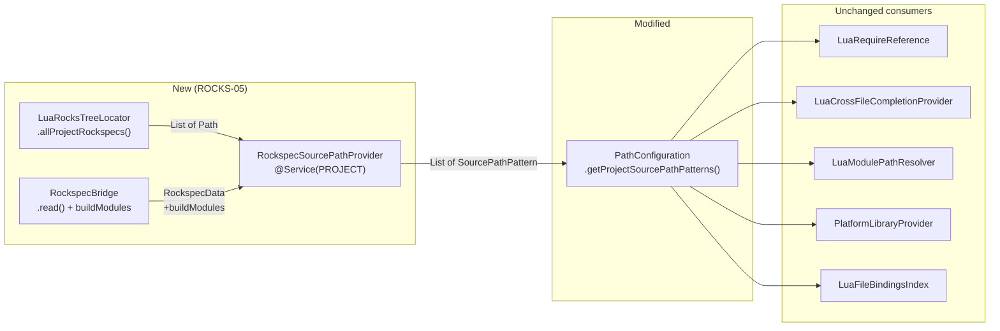

# Technical Design: ROCKS-05 — Rockspec Module Resolution

## 1. Architecture Overview

### Current State

Module resolution for `require()` goes through `PathConfiguration.getProjectSourcePathPatterns()`
([SourcePathPattern.kt:L19](file:///home/mini/Documents/src/lua/lunar/src/main/kotlin/net/internetisalie/lunar/lang/path/SourcePathPattern.kt#L19)),
which reads from `LuaProjectSettings.state.sourcePath` — a user-configured string defaulting to
system paths plus `$PROJECT_DIR$/?.lua;$PROJECT_DIR$/?/init.lua`. Rockspec `build.modules`
tables are never consulted: the bridge Lua script exports `build` in JSON
([rockspec.lua:L27](file:///home/mini/Documents/src/lua/lunar/src/main/resources/lua/rockspec.lua#L27))
but `RockspecBridge.parse()` ignores it
([RockspecBridge.kt:L49](file:///home/mini/Documents/src/lua/lunar/src/main/kotlin/net/internetisalie/lunar/rocks/RockspecBridge.kt#L49)).

### Prior Art in This Repo

| Component | Location | Disposition |
|-----------|----------|-------------|
| `PathConfiguration.getProjectSourcePathPatterns()` | [SourcePathPattern.kt:L19](file:///home/mini/Documents/src/lua/lunar/src/main/kotlin/net/internetisalie/lunar/lang/path/SourcePathPattern.kt#L19) | **Extended** — append rockspec-derived patterns after user patterns |
| `RockspecBridge` + `RockspecData` | [RockspecBridge.kt:L13-L67](file:///home/mini/Documents/src/lua/lunar/src/main/kotlin/net/internetisalie/lunar/rocks/RockspecBridge.kt#L13) | **Extended** — add `buildModules` field |
| `LuaRocksTreeLocator` | [LuaRocksTreeLocator.kt:L29](file:///home/mini/Documents/src/lua/lunar/src/main/kotlin/net/internetisalie/lunar/rocks/LuaRocksTreeLocator.kt#L29) | **Extended** — add `allProjectRockspecs()` method |
| `PlatformLibraryProvider.getExternalLibraries()` | [PlatformLibraryProvider.kt:L54](file:///home/mini/Documents/src/lua/lunar/src/main/kotlin/net/internetisalie/lunar/project/PlatformLibraryProvider.kt#L54) | **Unchanged** — inherits rockspec patterns via `PathConfiguration` |
| `LuaRequireReference.resolve()` | [LuaRequireReference.kt:L19](file:///home/mini/Documents/src/lua/lunar/src/main/kotlin/net/internetisalie/lunar/lang/LuaRequireReference.kt#L19) | **Unchanged** — inherits via `PathConfiguration` |
| `LuaCrossFileCompletionProvider` | [LuaCrossFileCompletionProvider.kt:L56](file:///home/mini/Documents/src/lua/lunar/src/main/kotlin/net/internetisalie/lunar/lang/completion/LuaCrossFileCompletionProvider.kt#L56) | **Unchanged** — inherits via `PathConfiguration` |
| `LuaModulePathResolver` | [LuaModulePathResolver.kt:L21](file:///home/mini/Documents/src/lua/lunar/src/main/kotlin/net/internetisalie/lunar/lang/path/LuaModulePathResolver.kt#L21) | **Unchanged** — inherits via `PathConfiguration` |

No existing component duplicated. The design extends `PathConfiguration` as the single integration point.

### Target State

```
PathConfiguration.getProjectSourcePathPatterns(project)
  ├── User-configured patterns (from LuaProjectSettings.state.sourcePath)
  └── Rockspec-derived patterns (from RockspecSourcePathProvider)
        ├── <project>/rocks/adt/lua/?.lua      ← from adt-1.0-1.rockspec
        ├── <project>/rocks/channels/lua/?.lua  ← from channels-1.0-1.rockspec
        └── <project>/rocks/cmd/lua/?.lua       ← from cmd-1.0-1.rockspec
```



## 2. Core Components

### 2.1 `net.internetisalie.lunar.rocks.RockspecSourcePathProvider`

- **Responsibility**: Project-level service that scans rockspecs, reads `build.modules`, derives `SourcePathPattern` entries, and caches them.
- **Threading**: Background (the `RockspecBridge.read()` subprocess blocks); results cached for EDT access.
- **Collaborators**:
  - `LuaRocksTreeLocator.allProjectRockspecs()` — discovers rockspec paths
  - `RockspecBridge.read()` — parses rockspec fields
  - `CachedValuesManager` — caches derived patterns
  - `VirtualFileManager.VFS_CHANGES` — invalidation trigger
- **Key API**:
  ```kotlin
  @Service(Service.Level.PROJECT)
  class RockspecSourcePathProvider(private val project: Project) {
      fun getPatterns(): List<SourcePathPattern>
  }
  ```

### 2.2 Modification: `net.internetisalie.lunar.rocks.RockspecBridge` / `RockspecData`

- **Responsibility**: Extend `RockspecData` with `buildModules: Map<String, String>`.
- **Key API change**:
  ```kotlin
  data class RockspecData(
      val packageName: String,
      val version: String?,
      val dependencies: List<String>,
      val buildModules: Map<String, String>,  // NEW
  )
  ```
  At [RockspecBridge.kt:L13](file:///home/mini/Documents/src/lua/lunar/src/main/kotlin/net/internetisalie/lunar/rocks/RockspecBridge.kt#L13).

### 2.3 Modification: `net.internetisalie.lunar.rocks.LuaRocksTreeLocator`

- **Responsibility**: Add `allProjectRockspecs(project)` that recursively scans the project tree.
- **Key API addition**:
  ```kotlin
  fun allProjectRockspecs(project: Project): List<Path>
  ```
  At [LuaRocksTreeLocator.kt:L29](file:///home/mini/Documents/src/lua/lunar/src/main/kotlin/net/internetisalie/lunar/rocks/LuaRocksTreeLocator.kt#L29).

### 2.4 Modification: `net.internetisalie.lunar.lang.path.PathConfiguration`

- **Responsibility**: Merge rockspec patterns into `getProjectSourcePathPatterns()`.
- **Key change** at [SourcePathPattern.kt:L19](file:///home/mini/Documents/src/lua/lunar/src/main/kotlin/net/internetisalie/lunar/lang/path/SourcePathPattern.kt#L19):
  ```kotlin
  fun getProjectSourcePathPatterns(project: Project): List<SourcePathPattern> {
      val state = LuaProjectSettings.getInstance(project).state
      val luaPath = state.expandSourcePath(project)
          .ifEmpty { DEFAULT_SOURCE_PATH.expandMacros(project) }
      val userPatterns = SourcePathPattern.patternsFromLuaPath(luaPath)
      val rockspecPatterns = project.getService(RockspecSourcePathProvider::class.java)
          .getPatterns()
      return userPatterns + rockspecPatterns
  }
  ```

## 3. Algorithms

### 3.1 Rockspec Discovery (allProjectRockspecs)

- **Input**: `Project`
- **Output**: `List<Path>` of all `.rockspec` files in the project tree
- **Steps**:
  1. Get `project.basePath`; convert to `Path`. If null, return empty.
  2. Walk the directory tree with `Files.walk()`, max depth 3.
  3. Filter: `isRegularFile && extension == "rockspec"`.
  4. Exclude paths containing `/lua_modules/` or `/.luarocks/` segments (these are installed-rock rockspecs, not source-rock rockspecs).
  5. Return all matching paths.
- **Complexity**: O(n) where n = files within 3 levels. Bounded by depth limit.

### 3.2 Build Modules Parsing (readBuildModules)

- **Input**: `JsonObject` from bridge output
- **Output**: `Map<String, String>` (module name → relative source path)
- **Steps**:
  1. Get `obj.get("build")`. If null or not an object → return empty map.
  2. Get `buildObj.get("modules")`. If null or not an object → return empty map.
  3. For each entry in `modules`:
     a. Key is the module name (string).
     b. Value: if it is a `JsonPrimitive` (string), add `key → value.asString` to the result.
     c. If value is a `JsonArray` or `JsonObject` (C module with source files), skip it.
  4. Return the map.
- **Edge cases**:
  - Module name with dots: `"adt.orderedmap"` — kept as-is (dots are part of the module name).
  - Relative paths with `../`: kept as-is (resolved later when computing patterns).

### 3.3 Pattern Derivation (derivePatterns)

- **Input**: `rockspecDir: Path`, `buildModules: Map<String, String>`
- **Output**: `Set<SourcePathPattern>` (deduplicated)
- **Steps**:
  1. For each `(moduleName, sourcePath)` in `buildModules`:
     a. Compute `moduleSlash = moduleName.replace('.', '/')`.
     b. Normalize `sourcePath` to forward slashes.
     c. Find `moduleSlash` in `sourcePath`:
        - If `sourcePath` ends with `"$moduleSlash.lua"`:
          `leadingPath = sourcePath.removeSuffix("$moduleSlash.lua")`
          `suffix = ".lua"`
        - Else if `sourcePath` ends with `"$moduleSlash/init.lua"`:
          `leadingPath = sourcePath.removeSuffix("$moduleSlash/init.lua")`
          `suffix = "/init.lua"`
        - Else: log warning, skip this entry (non-standard mapping).
     d. Resolve `leadingPath` against `rockspecDir`:
        `absoluteLeading = rockspecDir.resolve(leadingPath).normalize().toString() + "/"`
     e. Create `SourcePathPattern("$absoluteLeading?$suffix")`.
  2. Collect all patterns into a `Set` (deduplication by `spec` string).
  3. Return the set as a list.

- **Worked example**:
  - rockspecDir = `/proj/rocks/adt/`
  - Module: `"adt.orderedmap"` → source: `"lua/adt/orderedmap.lua"`
  - moduleSlash = `"adt/orderedmap"`
  - sourcePath ends with `"adt/orderedmap.lua"` → yes
  - leadingPath = `"lua/"`, suffix = `".lua"`
  - absoluteLeading = `/proj/rocks/adt/lua/`
  - Pattern: `/proj/rocks/adt/lua/?.lua`

- **Worked example (init.lua)**:
  - Module: `"mymod"` → source: `"lua/mymod/init.lua"`
  - moduleSlash = `"mymod"`
  - sourcePath ends with `"mymod/init.lua"` → yes
  - leadingPath = `"lua/"`, suffix = `"/init.lua"`
  - Pattern: `<dir>/lua/?/init.lua`

### 3.4 Caching and Invalidation

- **Input**: None (triggered on access)
- **Output**: `List<SourcePathPattern>`
- **Steps**:
  1. `RockspecSourcePathProvider.getPatterns()` uses `CachedValuesManager.getManager(project).createCachedValue(provider)`.
  2. The `CachedValueProvider` computes the patterns:
     a. Call `LuaRocksTreeLocator.allProjectRockspecs(project)`.
     b. For each rockspec path, call `RockspecBridge.read(project, path)`.
     c. For each `RockspecData` with non-empty `buildModules`, call `derivePatterns(rockspecDir, buildModules)`.
     d. Flatten and deduplicate all patterns.
  3. Cache dependency: `ProjectRootModificationTracker.getInstance(project)` — invalidates when project roots change (file add/remove/modify triggers this via VFS events reaching the project model).
- **Threading**: The `CachedValueProvider` computation runs in whatever thread calls `getPatterns()`. Since `PathConfiguration.getProjectSourcePathPatterns()` is called from both EDT (completion, references) and background threads, and `RockspecBridge.read()` spawns a subprocess, the provider must NOT call `RockspecBridge.read()` synchronously on every cache miss. Instead:
  - On first access (or invalidation), return an empty list and schedule background computation.
  - Background thread calls `RockspecBridge.read()` for each rockspec, then stores the patterns atomically.
  - Subsequent reads return the cached patterns.
  - Use `@Volatile` for thread-safe reads of the computed list.

## 4. External Data & Parsing

### 4.1 Rockspec Bridge JSON: `build.modules`

- **Format**: The Lua bridge script ([rockspec.lua](file:///home/mini/Documents/src/lua/lunar/src/main/resources/lua/rockspec.lua)) already exports `build` as a top-level field. A rockspec like:
  ```lua
  build = {
     type = "builtin",
     modules = {
        ["adt.orderedmap"] = "lua/adt/orderedmap.lua",
        ["adt.binaryheap"] = "lua/adt/binaryheap.lua",
     },
  }
  ```
  Produces JSON:
  ```json
  {
    "package": "adt",
    "version": "1.0-1",
    "dependencies": ["lua >= 5.1"],
    "build": {
      "type": "builtin",
      "modules": {
        "adt.orderedmap": "lua/adt/orderedmap.lua",
        "adt.binaryheap": "lua/adt/binaryheap.lua"
      }
    }
  }
  ```
- **Parse strategy**: `obj.getAsJsonObject("build")?.getAsJsonObject("modules")` → iterate entries, filter for string primitives.
- **Maps to**: `RockspecData.buildModules: Map<String, String>`
- **Failure handling**: Any parse failure (missing field, wrong type) → empty map, log warning.

## 5. Data Flow

### Example 1: require() Resolution in a Workspace Layout

1. User opens project with structure:
   ```
   rocks/adt/adt-1.0-1.rockspec   (modules: adt.orderedmap → lua/adt/orderedmap.lua)
   rocks/adt/lua/adt/orderedmap.lua
   src/main.lua                    (contains: require("adt.orderedmap"))
   ```
2. `RockspecSourcePathProvider` starts background scan:
   - `allProjectRockspecs()` finds `rocks/adt/adt-1.0-1.rockspec`.
   - `RockspecBridge.read()` returns `buildModules = {"adt.orderedmap": "lua/adt/orderedmap.lua"}`.
   - `derivePatterns()` produces `SourcePathPattern("<project>/rocks/adt/lua/?.lua")`.
3. User Ctrl+clicks on `require("adt.orderedmap")` in `main.lua`.
4. `LuaRequireReference.resolve()` calls `PathConfiguration.getProjectSourcePathPatterns()`.
5. Patterns include `<project>/rocks/adt/lua/?.lua`.
6. `pattern.interpolate("adt.orderedmap")` → `<project>/rocks/adt/lua/adt/orderedmap.lua`.
7. `LocalFileSystem.findFileByPath()` finds the file → resolution succeeds.

### Example 2: Auto-Import for Workspace Module

1. User types `orderedmap` in `src/main.lua`.
2. `LuaCrossFileCompletionProvider` processes globals.
3. `LuaModulePathResolver.resolve(orderedmap.lua_file, project)` reverses the pattern:
   - File path: `<project>/rocks/adt/lua/adt/orderedmap.lua`
   - Pattern `<project>/rocks/adt/lua/?.lua` matches.
   - Module name: `adt.orderedmap`.
4. Auto-import inserts `local orderedmap = require("adt.orderedmap")`.

## 6. Edge Cases

| Case | Handling |
|------|----------|
| No Lua interpreter configured | `RockspecBridge.read()` returns null; provider returns empty patterns; log warning |
| Rockspec has `build.type = "make"` (no `modules`) | `buildModules` is empty; no patterns derived for this rockspec |
| Module maps to C source (`{ "src/foo.c" }`) | Value is not a `JsonPrimitive`; skipped in §3.2 |
| Module path doesn't contain the module name | Pattern derivation fails; log warning and skip (§3.3 step 1c "else" branch) |
| Two rockspecs produce the same pattern | Deduplication via `Set` (§3.3 step 2) |
| `.rockspec` in `lua_modules/` (installed rock) | Excluded by discovery filter (§3.1 step 4) |
| Rockspec modified while cached | `ProjectRootModificationTracker` invalidates; background re-computes on next access |
| No rockspecs in project | `allProjectRockspecs()` returns empty; provider returns empty patterns |

## 7. Integration Points

No new `plugin.xml` registrations needed. The `RockspecSourcePathProvider` is a `@Service(PROJECT)` registered via Kotlin `@Service` annotation (auto-discovered by the platform; no XML entry required for `@Service`-annotated classes in IntelliJ 2024+).

Existing registrations that automatically benefit:
```xml
<!-- Already in plugin.xml — no changes needed -->
<extensions defaultExtensionNs="com.intellij">
    <psi.referenceContributor language="Lua"
        implementationClass="net.internetisalie.lunar.lang.LuaRequireReferenceContributor"/>
    <additionalLibraryRootsProvider
        implementationClass="net.internetisalie.lunar.project.PlatformLibraryProvider"/>
    <fileBasedIndex implementation="net.internetisalie.lunar.lang.indexing.LuaFileBindingsIndex"/>
</extensions>
```

## 8. Requirement Coverage

| Requirement | Priority | Implemented by (section) |
|-------------|----------|--------------------------|
| ROCKS-05-01 | M | §2.3, §3.1 |
| ROCKS-05-02 | M | §2.2, §3.2, §4.1 |
| ROCKS-05-03 | M | §3.3 |
| ROCKS-05-04 | M | §2.1, §2.4 |
| ROCKS-05-05 | S | §3.4 |
| ROCKS-05-06 | S | §3.3 (multiple patterns per rockspec via dedup set) |

## 9. Alternatives Considered

### Alternative A: Custom FileBasedIndex mapping module names to files
- Each rockspec module entry is indexed as `"adt.orderedmap" → <file>`.
- Pros: Exact mapping, no pattern inference.
- Cons: Requires every consumer (`LuaRequireReference`, completion, etc.) to query a new index in addition to `SourcePathPattern` resolution. Duplicates the resolution path. Much more code.
- **Rejected**: The pattern approach reuses the entire existing chain with a single integration point.

### Alternative B: Generate synthetic `LUA_PATH` entries into project settings
- On rockspec change, auto-append entries to `LuaProjectSettings.state.sourcePath`.
- Pros: Zero new code for resolution — existing infrastructure handles it.
- Cons: Mutates user settings; hard to distinguish auto-generated from user-entered paths; no clean invalidation; settings pollution.
- **Rejected**: Mixing generated and user-authored data in the same settings field is error-prone.

## 10. Open Questions

_None — feature has cleared the planning bar._
